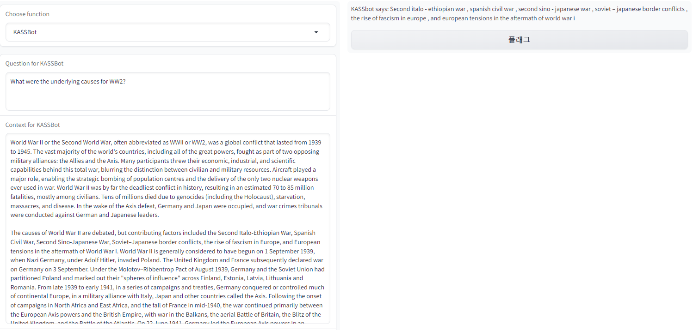
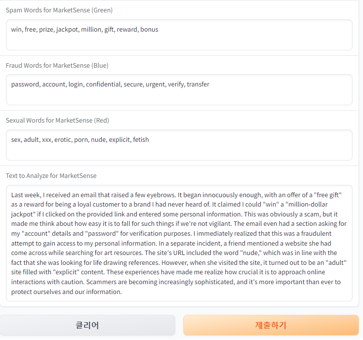
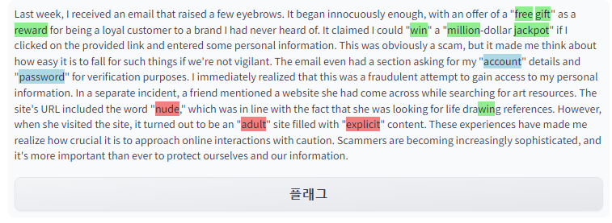

# KASSBot Project

**Duration**: June 2023 - July 2023  
**Organization**: Accenture

KASSBot is an innovative AI tool developed during a tenure at Accenture, specifically for a competition for M***. It's a dual-purpose AI model designed for automated content moderation and in-depth text analysis. By leveraging the power of BERT and Transformer models, KASSBot not only identifies and highlights problematic content within texts but also possesses the capability to answer intricate questions based on a given context. The tool's versatility is further accentuated by its support for content moderation in multiple languages, showcasing immense potential for automating large-scale moderation tasks. This paves the way for enhancing the efficiency and safety of online platforms and environments.

## Features

### 1. Automated Content Moderation

KASSBot's MarketSense functionality is adept at analyzing texts for specific keywords related to spam, fraud, and sexual content. It employs different color codes for easy identification:

- **Spam Words**: Highlighted in light green.
- **Fraud Words**: Highlighted in light blue.
- **Sexual Words**: Highlighted in light coral.
- **Toxic Sentences**: Highlighted in red.

The tool's ability to discern and highlight potentially toxic sentences in the text makes it a valuable asset for online platforms aiming to maintain a safe user environment.

### 2. Advanced Text Analysis (Question Answering)

KASSBot is equipped with a sophisticated question-answering mechanism. By utilizing the BERT-large model fine-tuned on the SQuAD dataset, it can extract and return the most relevant answer to a question based on its provided context.

## User Interface

The user-friendly interface, powered by Gradio, offers a seamless experience. Users can effortlessly switch between KASSBot's content moderation and text analysis functionalities:

1. **For Content Moderation**:
   - Choose "MarketSense" from the dropdown.
   - Specify keywords for spam, fraud, and sexual content.
   - Input the text you wish to analyze.
   - Submit to view the highlighted results.

2. **For Text Analysis**:
   - Select "KASSBot" from the dropdown.
   - Input your question and its context.
   - Submit to receive the answer.

## How to Use

To launch the KASSBot interface, simply execute the script. The Gradio interface will be accessible via your default web browser, ensuring a smooth user experience.

---

Contributions, feedback, and suggestions for KASSBot are always welcome. Together, we can refine and enhance this tool to further its impact in the realm of online content moderation and text analysis.
